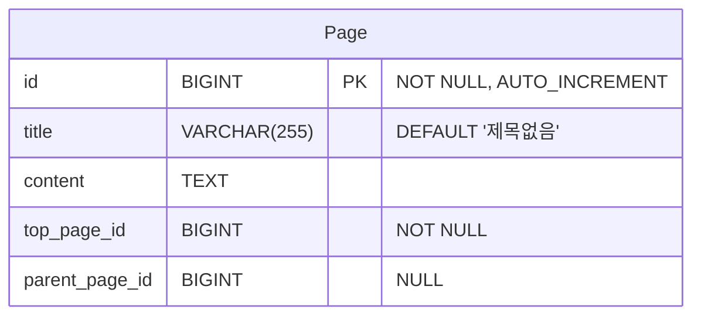
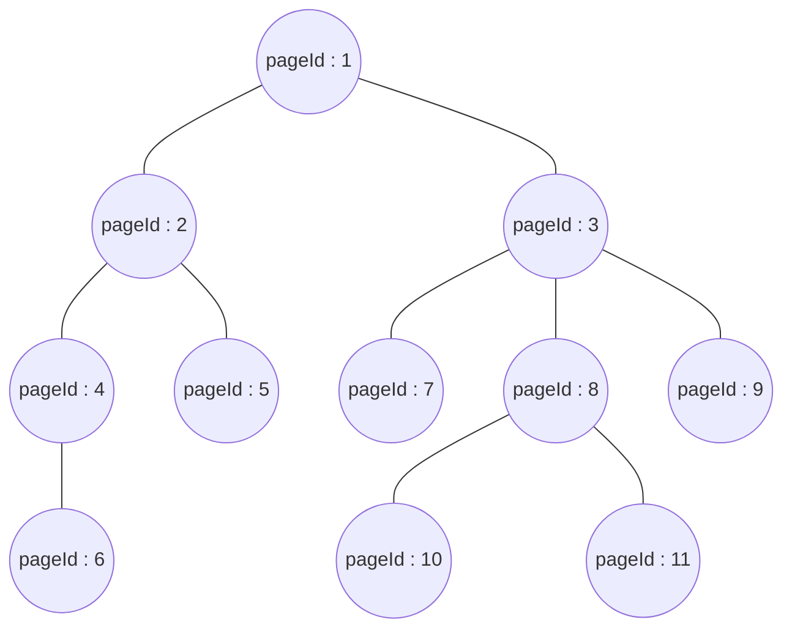

# Team 16 - @Mapping

## 테이블 구조



- id : 고유 식별자
- title : 제목
- content : 내용
- top_page_id : 최상위 노드의 고유 식별자
- parent_page_id : 상위 노드의 고유 식별자

## 비즈니스 로직

🤔 접근 방식

- 작성된 페이지들의 depth가 깊어질 수록 Join이 많아져 조회 성능이 비효율적이다.
- Join을 쓰지 않고 조회하기 위하여 그래프 구조를 생각해보았다.
- 최상위 페이지의 정보와 부모 페이지의 정보를 가지고 있다면 그래프 탐색이 가능하다.

### 🎯 예시를 통한 그래프 구조

> - `1페이지` 안에 `2페이지` 와 `3페이지` 가 있다.
> - `2페이지` 안에 `4페이지` 와 `5페이지` 가 있다.
> - `4페이지` 안에 `6페이지` 가 있다.
> - `3페이지` 안에 `7페이지` 와 `8페이지` 와 `9페이지` 가 있다.
> - `8페이지` 안에 `10페이지` 와 `11페이지` 가 있다.

#### 🚀 insert

- 최상위 노드 : top_page_id
- 상위 노드 : parent_page_id

`pageId: 1` 을 생성할 때 최상위 노드를 `1` 로 상위 노드를 `null` 로 추가한다.<br />
`pageId: 2` 를 생성할 때 최상위 노드를 `1` 로 상위 노드를 `1` 로 추가한다.<br />
`pageId: 3` 를 생성할 때 최상위 노드를 `1` 로 상위 노드를 `1` 로 추가한다.<br /><br />

`pageId: 4` 를 생성할 때 최상위 노드를 `1` 로 상위 노드를 `2` 로 추가한다.<br />
`pageId: 5` 를 생성할 때 최상위 노드를 `1` 로 상위 노드를 `2` 로 추가한다.<br />
`pageId: 6` 을 생성할 때 최상위 노드를 `1` 로 상위 노드를 `4` 로 추가한다.<br /><br />

`pageId: 7` 를 생성할 때 최상위 노드를 `1` 로 상위 노드를 `3` 로 추가한다.<br />
`pageId: 8` 를 생성할 때 최상위 노드를 `1` 로 상위 노드를 `3` 로 추가한다.<br />
`pageId: 9` 을 생성할 때 최상위 노드를 `1` 로 상위 노드를 `3` 로 추가한다.<br />
`pageId: 10` 를 생성할 때 최상위 노드를 `1` 로 상위 노드를 `8` 로 추가한다.<br />
`pageId: 11` 를 생성할 때 최상위 노드를 `1` 로 상위 노드를 `8` 로 추가한다.<br /><br />

insert 로직을 수행한다면 아래와 같이 데이터를 그래프화 할 수 있다.



#### 🚀 read

1. 만약 `pageId : 4` 페이지를 조회한다면<br />
   `pageId : 1`, `pageId : 2`, `pageId : 4` 가 `Breadcrumbs` 정보가 되고<br />
   `pageId : 6` 이 `서브 페이지 리스트` 정보가 된다.
2. 만약 `pageId : 3` 페이지를 조회한다면<br />
   `pageId : 1`, `pageId : 3` 이 `Breadcrumbs` 정보가 되고<br />
   `pageId : 7`, `pageId : 8`, `pageId : 9` 가 `서브 페이지 리스트` 정보가 된다.

<br />
<br />

#### 🚀 `pageId : 8` 조회 예시

1. `pageId : 8` 에 있는 top_page_id(최상위 노드)인 `pageId : 1` 이 `top_page_id` 인 데이터를 조회하여
2. `pageId : 1`, `pageId : 2`... `pageId : 11` 까지 데이터를 취득한다.
3. `top_page_id` 와 `parent_page_id` 를 통해 그래프 구조를 만든다. (ex. 2차원 배열, 자료 구조 등)
4. `parent_page_id` 는 양방향 간선으로 생각한다.
5. `top_page_id` 를 시작으로 `pageId : 8` 까지 최단 방향을 찾는다.
6. 최단 방향을 찾기 위해 그래프 탐색을 활용하여 `pageId : 1` -> `pageId : 3` -> `pageId : 8` 결과를 얻는다.
7. `pageId : 8` 가 `parent_page_id` 인 데이터를 조회하여
8. `pageId : 10`, `pageId : 11` 을 취득한다.
9. `Breadcrumbs` 의 값은 [`pageId : 1`, `pageId : 3`, `pageId : 8`]
10. `서브 페이지 리스트` 의 값은 [`pageId : 10`, `pageId : 11`]

## 결과 정보

```json
{
   "pageId": 8,
   "title": "Linked List란 무엇인가요?",
   "cotent": "연결 리스트(Linked List)는 배열과 비교했을 때, 삽입/삭제 연산에 효율적인 자료구조입니다.",
   "subPages": [
      10,
      11
   ],
   "breadcrumbs": [
      1,
      3,
      8
   ]
}
```